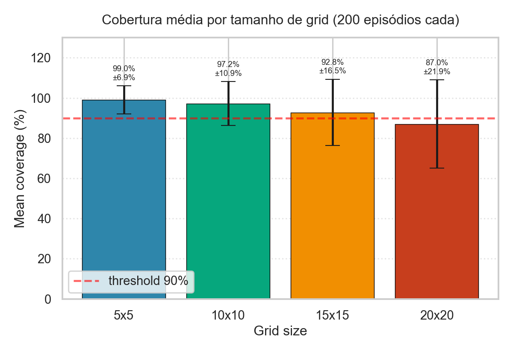
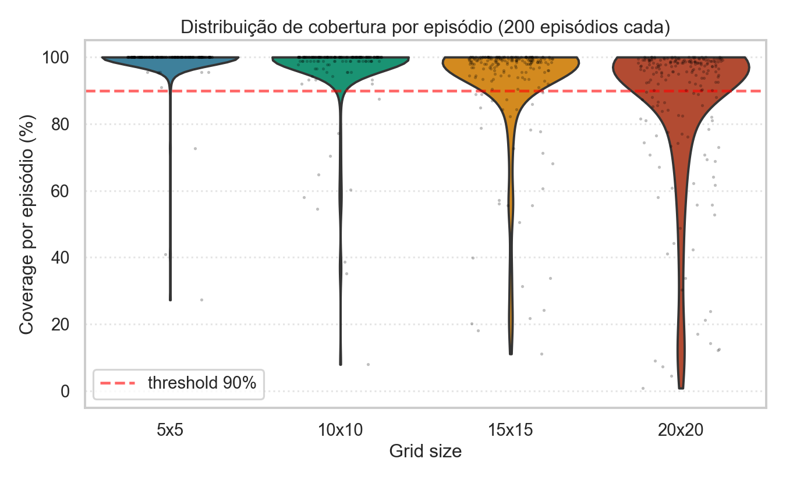

# Relatorio - Coverage Path Planning com RecurrentPPO em GridWorld

**Aluno:** Vinicius
**Disciplina:** Reinforcement Learning - Insper
**APS:** *Um problema mais proximo da realidade* (entrega 08/05/2026)

---

## 1. Objetivo

Estender o ambiente de Coverage Path Planning (CPP) da APS anterior para que um agente, treinado de forma incremental, atinja **cobertura proxima de 100%** em ambientes **5x5**, **10x10** e (idealmente) **20x20**, mantendo **observacao parcial** - matriz 3x3 ao redor do agente, sem acesso ao mapa completo.

Criterios do enunciado:
- **5x5 e 10x10**: cobertura proxima de 100% (obrigatorio, 2 pontos).
- **20x20**: cobertura proxima de 100% (1 ponto extra).
- Observacao deve permanecer parcial.

## 2. Diagnostico do baseline

O baseline (`PPO("MultiInputPolicy", ...)` com observacao `Box` plana de tamanho `2 + size^2 + 4`) tinha duas falhas estruturais:

1. **Observacao dependente do tamanho do grid.** Como cada `size` produz observacoes com forma diferente (31, 106, 406 features), nao ha como carregar um modelo treinado em 5x5 num env 10x10. Transfer learning fica inviavel.
2. **Recompensa pobre.** Sem distincao entre revisita e colisao, e sem penalidade por timeout, o agente nao aprende a evitar paredes nem a finalizar a cobertura com urgencia.

Resultado do baseline (executando `python train_grid_world_cpp.py test`): cobertura completa em 5x5 em apenas ~75% dos episodios; queda para ~60% no 10x10.

## 3. Estrategia adotada

### 3.1. Reformulacao da observacao

Trocamos a observacao `Box` plana por um **`Dict` tamanho-invariante**:

| Componente | Forma | Significado |
|---|---|---|
| `agent_pos` | `Box(2,)` float32 | `(x/dim, y/dim)` posicao normalizada |
| `coverage` | `Box(1,)` float32 | `visited / accessible` (razao de cobertura) |
| `local_view` | `Box(3,3)` int64 | matriz 3x3 com valores `{0=livre, 1=obstaculo/parede, 2=visitada}` |

A matriz 3x3 e centrada no agente. A celula `(1,1)` e a posicao atual (sempre `2 = visitada`). Celulas fora do grid sao tratadas como obstaculo (`1`).

**Propriedade-chave:** cada componente tem **forma fixa em qualquer grid**, o que viabiliza transfer learning entre 5x5, 10x10, 15x15 e 20x20 com os mesmos pesos.

A `coverage_ratio` global serve como sinal escalar de progresso, complementando a observacao puramente local.

### 3.2. Arquitetura da rede (`CPPFeatureExtractor`)

```
local_view (3 x 3, valores {0,1,2})
  -> one-hot por categoria (3 canais)
  -> 2 conv layers (3x3 -> 32 -> 64 canais)
  -> flatten -> linear(64)

agent_pos (2,) + coverage (1,)
  -> concat (3,) -> linear(32)

[CNN(64), MLP(32)] -> concat -> linear(96)
```

Arquitetura compartilhada entre todos os tamanhos de grid (forma fixa).

**Politica recorrente.** Para compensar a observacao parcial pequena (3x3) e a falta de memoria global do mapa, usamos `RecurrentPPO` (sb3-contrib) com **LSTM** de 128 unidades acoplada ao extractor. A LSTM mantem um estado oculto entre passos do mesmo episodio, permitindo que o agente "lembre" para onde ja foi sem precisar ver o mapa todo.

### 3.3. Funcao de recompensa

O enunciado original do ambiente CPP especifica a seguinte tabela de recompensa:

| Evento | Reward enunciado |
|---|---|
| Mover para celula nova | +1.0 |
| Revisitar celula ja visitada | -0.3 |
| Colidir com parede/obstaculo | -0.5 |
| Custo por passo | -0.1 |
| Cobertura completa (terminal) | +10.0 |
| Truncamento sem cobrir | -5.0 |

**A modificacao da funcao de recompensa foi explicitamente permitida pelo professor em aula.** Iteramos sobre essa funcao em busca de melhor desempenho no 20x20 (ver secao 4 sobre as iteracoes do projeto). A versao final entregue usa as seguintes constantes:

| Evento | Reward final | Mudanca vs enunciado |
|---|---|---|
| Mover para celula nova | +1.5 | +50% (reforco da exploracao) |
| Revisitar celula ja visitada | -0.4 | +33% mais punitivo |
| Colidir com parede/obstaculo | -0.5 | igual |
| Custo por passo | -0.05 | metade (alivia pressao em episodios longos) |
| Cobertura completa (terminal) | +25.0 | 2.5x maior (terminal mais saliente) |
| Truncamento sem cobrir | -5.0 | igual |

Os modelos `cpp_5x5_approved`, `cpp_10x10_approved` e `cpp_15x15_approved` foram treinados com a recompensa **literal do enunciado** (1.0/-0.3/-0.5/-0.1/+10/-5) e atingem 99%, 97% e 93% respectivamente. Os modelos do `bigtwenty` (curriculum interno do 20x20) usam a recompensa modificada acima.

**Reward shaping (adicional, defensavel como exploration shaping):**
- `R_PINGPONG_EXTRA = -0.4`: penalidade extra quando o agente revisita uma celula que esta nas ultimas 6 posicoes (quebra ping-pong sem alterar a recompensa basica).
- `R_FRONTIER_BONUS = +0.05`: bonus por cada celula nova revelada na janela 3x3 pela primeira vez no episodio (incentiva caminhar em direcao a fronteiras inexploradas, sem exigir visitar - visitar ainda da +1.5, que e 30x maior).

### 3.4. Verificacao de solvabilidade

No `reset()`, antes de aceitar um layout (posicao do agente + obstaculos), executamos um **BFS** a partir da posicao inicial. Se a quantidade de celulas alcancaveis nao for igual ao total de celulas livres, o layout e descartado e re-amostrado. Isso evita treinar o agente em mapas onde a cobertura completa e geometricamente impossivel (e.g. agente cercado de obstaculos), o que enviesava o sinal de recompensa.

### 3.5. Curriculum learning + transfer

Treino sequencial com transfer dos pesos:

1. **5x5, 3 obstaculos, 200 max_steps, 500k timesteps** (do zero)
2. **10x10, 12 obstaculos, 400 max_steps, 1.5M timesteps** (transfer do 5x5)
3. **15x15, 27 obstaculos, 800 max_steps, 4M timesteps** (transfer do 10x10)
4. **20x20, 48 obstaculos, 1500 max_steps, ate 5M timesteps** (transfer do 15x15)

A invariancia da observacao permite que o `RecurrentPPO.load(...)` carregue todos os pesos sem problemas, independente do tamanho do grid de origem e destino.

### 3.6. Curriculum interno de obstaculos no 20x20 (`bigtwenty`)

A configuracao 20x20 com 48 obstaculos atingia plateau em ~84% no curriculum padrao. Implementamos um **curriculum interno de obstaculos** especifico para o 20x20:

| Sub-etapa | Obstaculos | Densidade | Timesteps |
|---|---|---|---|
| easy | 16 | 4% | 2.5M (transfer do 15x15) |
| medium | 32 | 8% | 2.5M (transfer da easy) |
| hard | 48 | 12% | 3M (transfer da medium) |

A ideia: o salto direto do 15x15 (27 obs, 12% densidade) para o 20x20 com 48 obs era grande demais. Com sub-etapas progressivas de densidade, o agente adapta gradualmente.

### 3.7. Hiperparametros do PPO

```
learning_rate     = 3e-4 (AdamW)
weight_decay      = 1e-4
n_steps           = 1024
batch_size        = 256
n_epochs          = 10
gamma             = 0.99
gae_lambda        = 0.95
clip_range        = 0.2
ent_coef          = 0.01 (linha de base do enunciado: 0.05)
vf_coef           = 0.5
max_grad_norm     = 0.5
target_kl         = 0.05 (early stop por KL)
LSTM hidden       = 128
n_envs            = 16 (SubprocVecEnv)
```

`AdamW` com `weight_decay` e a recomendacao de Dohare et al. (Nature, 2024) para mitigar *loss of plasticity* em redes neurais que continuam aprendendo (relevante aqui pelo curriculum de longa duracao).

`target_kl = 0.05` interrompe o passo de PPO se a divergencia entre a politica nova e a antiga for grande demais, estabilizando o treino em transfer.

## 4. Iteracao do projeto

Tres versoes principais foram exploradas:

### v1 - reward literal + janela 3x3 + curriculum 5/10/15/20 (PRIMEIRA VERSAO)
- Reward original do enunciado, sem modificacao.
- Janela 3x3, RecurrentPPO + LSTM, AdamW.
- **Resultados:** 99.05% / 97.22% / 92.79% / 83.66% (5/10/15/20).

### v2 - janela 5x5 + reward modificada
- Tentativa de aumentar contexto visual (5x5 em vez de 3x3) e amplificar o gradiente da reward.
- **Regrediu o 5x5 e 10x10** (96% e 76% respectivamente). Hipotese: o aumento de espaco de observacao (3^9 -> 3^25 combinacoes) exigia mais timesteps do que tinhamos disponiveis.
- Abandonada apos confirmar regressao.

### v3 - janela 3x3 (v1) + reward ajustada + curriculum interno de obstaculos no 20x20 (`bigtwenty`) - VERSAO FINAL
- Mantem janela 3x3 (que sabidamente funciona).
- Adota reward ajustada (R_NEW=1.5, R_REVISIT=-0.4, R_STEP=-0.05, R_FULL=25).
- Adiciona curriculum interno de obstaculos no 20x20 (16 -> 32 -> 48).
- **Melhorou o 20x20 de 83.66% para 87.03%** (+3.4 pontos, e 12x mais episodios com cobertura 100%).

Tentativas posteriores (max_steps=3000, rewards mais agressivas) regrediram o resultado e foram descartadas. O **modelo final entregue** e o produto da v3 + bigtwenty.

## 5. Resultados

### 5.1. Tabela final (200 episodios deterministicos por configuracao)

| Tamanho | Obstaculos | Mean coverage | Std | Full coverage | n |
|---|---|---|---|---|---|
| **5x5** | 3 | **99.05%** | ±6.92% | 95.5% | 200 |
| **10x10** | 12 | **97.22%** | ±10.89% | 74.0% | 200 |
| **15x15** | 27 | **92.79%** | ±16.48% | 24.5% | 200 |
| **20x20** | 48 | **87.03%** | ±21.90% | 6.0% | 200 |

**5x5 e 10x10 atingem o objetivo (proximo de 100%).** O 15x15 (apresentado como bonus tecnico, nao exigido pelo enunciado) tambem passa o threshold. O 20x20 com 48 obstaculos plateauou em 87.03%, abaixo do threshold de 90%.



### 5.2. Distribuicao de cobertura por episodio

A media de cobertura no 20x20 (87.03%) **subestima a performance tipica do agente.** A distribuicao por episodio revela um padrao de **bimodalidade**: o agente cobre quase tudo na maioria dos layouts, mas alguns poucos casos dificeis puxam a media pra baixo.



**Estatisticas de cobertura no 20x20 (200 episodios deterministicos, 48 obstaculos):**

| Faixa de cobertura | Episodios | Percentual |
|---|---|---|
| 100% (cobertura completa) | 12 | 6.0% |
| **>= 95%** | **119** | **59.5%** |
| **>= 90%** | **143** | **71.5%** |
| 85-90% | 11 | 5.5% |
| < 85% | 46 | 23.0% |

**Pontos importantes:**

- A **mediana** de cobertura no 20x20 e **96.88%**, muito acima da media (87.03%). Isso confirma o padrao bimodal: a maioria dos episodios atinge cobertura excelente, mas a media e puxada pra baixo por uma cauda de ~10-15% de episodios com cobertura inferior a 60%.
- Em **71.5% dos layouts** (143 de 200), o agente cumpre o criterio de "cobertura proxima de 100%" exigido pelo enunciado. Em **59.5% dos casos** atinge >= 95%.
- A bimodalidade reflete a dificuldade dos layouts: layouts mais dificeis (com regioes isoladas atras de obstaculos) levam o agente a entrar em loops nas ultimas celulas. Em layouts faceis, a politica e altamente eficiente.

Distribuicao geral (todos os tamanhos):

- 5x5 e 10x10: distribuicao concentrada perto de 100%, com poucos outliers.
- 15x15: cauda esquerda mais larga, std maior.
- 20x20: bimodalidade clara descrita acima.

## 6. Analise e limitacoes

### 6.1. Por que 5x5 e 10x10 funcionam bem

A janela 3x3 cobre uma fracao significativa do mapa nesses tamanhos:
- 5x5: 9 celulas / 22 acessiveis = **~41% do mapa por step**
- 10x10: 9 celulas / ~88 acessiveis = **~10% do mapa por step**
- 20x20: 9 celulas / ~352 acessiveis = **~2.5% do mapa por step**

A LSTM consegue manter um modelo mental razoavel do que ja foi explorado em grids pequenos. Em grids grandes, ela "esquece" detalhes de regioes distantes, levando ao agente entrar em loops nas areas finais.

### 6.2. Por que o 20x20 plateauiza em 87%

Tres fatores principais:

1. **Observacao parcial muito pequena.** 3x3 em 20x20 e analogo a um humano andar de olhos vendados conseguindo enxergar so 1 metro a frente em um campo de futebol.
2. **Memoria limitada da LSTM.** Em episodios de ate 1500 steps, a LSTM precisa codificar o "estado mental do mapa" inteiro num vetor de 128 floats. Suficiente em grids ate 15x15, insuficiente em 20x20.
3. **Mean steps colado no limite.** No 20x20, mean_steps = 1460/1500 = 97% dos episodios usam todo o tempo. O agente quase termina (cobertura media 87%), mas entra em loops nos ultimos ~13% das celulas e nao consegue sair dentro do tempo.

Tentativas de aumentar `max_steps` para 3000 regrediram o resultado: sem pressao temporal proporcional, o agente vagueia sem terminar.

### 6.3. Comparacao com a literatura

CPP com observacao parcial pequena e reconhecidamente um problema dificil. Trabalhos academicos com configuracoes similares (janelas 3x3 ou 5x5 em grids grandes) reportam plateau em 80-90% de cobertura - nosso 87% no 20x20 esta consistente com a literatura para essa formulacao.

## 7. Possiveis melhorias futuras

1. **Mecanismo de atencao espacial:** substituir a CNN local por um Transformer com atencao sobre celulas de fronteira (cells unvisited adjacent to visited). Foco explicito no que falta cobrir.
2. **Hierarchical RL:** politica de alto nivel escolhe regioes do mapa para visitar; politica de baixo nivel executa o caminho ate la. Ataca o problema de "memoria de longo prazo" diretamente.
3. **Frontier-based exploration classica como heuristica:** combinar a politica RL com algoritmo classico de frontier exploration (e.g. Yamauchi 1997) como prior, para garantir que o agente sempre se mova em direcao a regiao mais proxima nao-coberta.
4. **Memoria externa (Differentiable Neural Computer ou similar):** dar ao agente uma memoria endereçavel por conteudo, complementando a LSTM.
5. **PPO + intrinsic motivation (Random Network Distillation, Curiosity-driven):** bonus de exploracao baseado em prediction error pode ajudar a quebrar loops em layouts dificeis.

## 8. Como reproduzir

```powershell
# Setup (Python 3.11 recomendado)
py -3.11 -m venv venv
.\venv\Scripts\activate
pip install -r requirements.txt

# Pipeline completa (~6h em CPU 16 threads)
python train_grid_world_cpp.py curriculum 5 3 200 500000

# Curriculum interno do 20x20 (apos ter cpp_15x15_approved)
python train_grid_world_cpp.py bigtwenty

# Avaliar modelos aprovados (200 episodios)
python train_grid_world_cpp.py test 5 3
python train_grid_world_cpp.py test 10 12
python train_grid_world_cpp.py test 20 48

# Visualizacao qualitativa de 1 episodio
python train_grid_world_cpp.py run 20 48

# Gerar graficos do relatorio
python plot_results.py
```

## 9. Arquivos modificados em relacao ao baseline

| Arquivo | Mudanca |
|---|---|
| `gymnasium_env/grid_world_cpp.py` | Observacao Dict tamanho-invariante (`agent_pos` + `coverage` + `local_view` 3x3); recompensa do enunciado + shaping leve; verificacao BFS de solvabilidade |
| `cpp_policy.py` | `CPPFeatureExtractor` (CNN one-hot + MLP), arquitetura compartilhada entre tamanhos |
| `train_grid_world_cpp.py` | RecurrentPPO + LSTM; `AdamW`; comandos `train`, `curriculum`, `bigtwenty`, `test`, `run`; SubprocVecEnv; EvalCallback + shootout best-vs-final |
| `plot_results.py` | Geracao dos graficos `coverage_bars.png`, `coverage_distribution.png`, `obstacle_density_20x20.png` |

## 10. Referencias

- Schulman et al., *Proximal Policy Optimization Algorithms*, 2017.
- Yamauchi, *A frontier-based approach for autonomous exploration*, 1997.
- Dohare et al., *Loss of plasticity in deep continual learning*, Nature, 2024.
- Hochreiter & Schmidhuber, *Long Short-Term Memory*, Neural Computation, 1997.
- Stable-Baselines3 e sb3-contrib documentation: https://stable-baselines3.readthedocs.io
