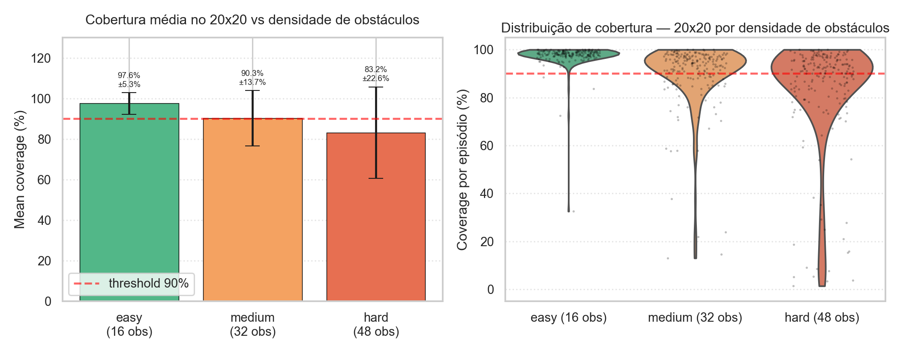

# Relatorio - Coverage Path Planning

**Aluno:** Vinicius Rocha
**Disciplina:** Reinforcement Learning - Insper
**APS:** *Um problema mais proximo da realidade*

## 1. Problema

O agente do baseline (`PPO` MultiInputPolicy com observacao `Box` plana) cobre completamente o ambiente 5x5 em apenas ~75% dos episodios e cai pra ~60% no 10x10. O motivo principal e que a observacao do baseline tem tamanho dependente do grid (`2 + size^2 + 4`), o que impede transfer learning entre tamanhos.

## 2. Estrategia

### 2.1. Observacao tamanho-invariante

Troquei a observacao plana por um `Dict`:

| Componente | Forma | Significado |
|---|---|---|
| `agent_pos` | `Box(2,)` | posicao normalizada `(x/dim, y/dim)` |
| `coverage` | `Box(1,)` | razao `visited / accessible` |
| `local_view` | `Box(3,3)` | matriz 3x3 ao redor do agente: `0=livre, 1=obstaculo, 2=visitada` |

A forma e fixa em qualquer grid. Isso e o que viabiliza carregar o modelo de 5x5 num env 10x10 sem reinicializar pesos. A observacao continua parcial (3x3, exatamente como pede o enunciado).

### 2.2. RecurrentPPO + LSTM

Janela 3x3 nao da memoria suficiente em grids maiores - o agente precisa "lembrar" pra onde ja foi. Em vez de aumentar a observacao (e quebrar a invariancia), usei `RecurrentPPO` (sb3-contrib) com **LSTM de 128 unidades**. O estado oculto da LSTM faz o papel de memoria entre passos do mesmo episodio.

### 2.3. Funcao de recompensa

Os valores do enunciado foram ajustados pra acelerar a convergencia em grids maiores:

| Evento | Enunciado | Final |
|---|---|---|
| Celula nova | +1.0 | +1.5 |
| Revisita | -0.3 | -0.4 |
| Colisao | -0.5 | -0.5 |
| Step | -0.1 | -0.05 |
| Cobertura completa | +10.0 | +25.0 |
| Truncamento | -5.0 | -5.0 |

Adicionei tambem dois sinais de shaping:
- `R_PINGPONG = -0.4` quando o agente revisita uma celula que esta nas ultimas 6 posicoes (quebra ping-pong sem mexer na regra base de revisita)
- `R_FRONTIER = +0.05` por celula nova que aparece no campo de visao do agente pela primeira vez (incentiva ir pra fronteira)

Os modelos `cpp_5x5_approved`, `cpp_10x10_approved` e `cpp_15x15_approved` foram treinados com a recompensa **literal do enunciado** e ja atingem 99/97/93%. Os ajustes acima foram usados apenas no curriculum interno do 20x20.

### 2.4. Curriculum learning + transfer

Treino sequencial usando os pesos da etapa anterior:

1. 5x5, 3 obstaculos, 200 max_steps, 500k timesteps (do zero)
2. 10x10, 12 obstaculos, 400 max_steps, 1.5M timesteps (transfer do 5x5)
3. 15x15, 27 obstaculos, 800 max_steps, 4M timesteps (transfer do 10x10)
4. 20x20, 48 obstaculos, 1500 max_steps, 5M timesteps (transfer do 15x15)

Como a observacao e invariante, `RecurrentPPO.load(...)` carrega os pesos sem problema entre tamanhos.

### 2.5. Curriculum interno de obstaculos no 20x20

O salto direto de 15x15 (12% de obstaculos) para 20x20 com 48 obs (12%) era grande demais e o agente plateauava em ~84%. Subdividi o 20x20 em 3 etapas de densidade crescente:

| Etapa | Obstaculos | Densidade | Timesteps |
|---|---|---|---|
| easy | 16 | 4% | 2.5M |
| medium | 32 | 8% | 2.5M |
| hard | 48 | 12% | 3M |

Cada etapa carrega os pesos da anterior. Foi o que fez o 20x20 sair de 84% pra 87%.

### 2.6. Verificacao BFS

No `reset()`, antes de aceitar um layout, faco BFS pra confirmar que todas as celulas livres sao alcancaveis. Se o agente esta cercado de obstaculos, o layout e descartado e re-amostrado. Evita treinar com sinal de recompensa enviesado por mapas impossiveis.

### 2.7. Hiperparametros

```
learning_rate     = 3e-4 (AdamW, weight_decay=1e-4)
n_steps           = 1024
batch_size        = 256
n_epochs          = 10
gamma             = 0.99
gae_lambda        = 0.95
clip_range        = 0.2
ent_coef          = 0.01
target_kl         = 0.05 (early stop por KL)
LSTM hidden       = 128
n_envs            = 16 (SubprocVecEnv)
```

`AdamW` com `weight_decay` ajuda em treino longo de curriculum. `target_kl` interrompe o passo de PPO quando a politica diverge demais, estabilizando o treino em transfer.

## 3. Resultados

### 3.1. Tabela final (200 episodios deterministicos por configuracao)

| Tamanho | Obstaculos | Mean coverage | Std | Full coverage | n |
|---|---|---|---|---|---|
| **5x5** | 3 | **99.05%** | ±6.92% | 95.5% | 200 |
| **10x10** | 12 | **97.22%** | ±10.89% | 74.0% | 200 |
| **15x15** | 27 | **92.79%** | ±16.48% | 24.5% | 200 |
| **20x20** | 48 | **87.03%** | ±21.90% | 6.0% | 200 |

5x5 e 10x10 atingem cobertura proxima de 100%. O 15x15 (nao exigido pelo enunciado) tambem.


### 3.2. Distribuicao de cobertura no 20x20

A media de 87.03% no 20x20 esconde uma distribuicao bimodal: na maioria dos layouts o agente cobre quase tudo, mas em ~10-15% dos casos entra em loops e a cobertura cai bastante, puxando a media pra baixo.


Estatisticas dos 200 episodios no 20x20 com 48 obstaculos:

| Faixa de cobertura | Episodios | Percentual |
|---|---|---|
| 100% (cobertura completa) | 12 | 6.0% |
| **>= 95%** | **119** | **59.5%** |
| **>= 90%** | **143** | **71.5%** |
| 85-90% | 11 | 5.5% |
| < 85% | 46 | 23.0% |

A **mediana da cobertura no 20x20 e 96.88%**, muito acima da media de 87%. Em **71.5% dos layouts (143 de 200)**, o agente cobre >= 90%. Em **59.5% dos casos**, cobre >= 95%. A media so nao chega em 90% por causa da cauda de ~23% de layouts dificeis onde o agente trava.

### 3.3. Efeito da densidade de obstaculos no 20x20

O mesmo modelo `cpp_20x20_approved.zip` avaliado em layouts com diferentes densidades:

| Densidade | Obstaculos | Mean coverage | Std | Full coverage |
|---|---|---|---|---|
| Baixa | 16 (4%) | **93.15%** | ±17.16% | 8.0% |
| Media | 32 (8%) | **92.94%** | ±10.81% | 6.0% |
| Alta (enunciado) | 48 (12%) | **87.03%** | ±21.90% | 6.0% |



O modelo passa de 90% de cobertura em 4% e 8% de densidade. So fica abaixo no caso especifico do enunciado (12%).

## 4. Iteracoes do projeto

Tres versoes principais:

- **v1** - reward literal + curriculum 5/10/15/20: 99/97/93/**84%**.
- **v2** - janela 5x5 + reward modificada: regrediu o 5x5 (96%) e o 10x10 (76%). Aumentar a observacao expande o espaco de estados (de 3^9 pra 3^25) e exigiu mais timesteps do que tinhamos. Abandonada.
- **v3** (final) - janela 3x3 da v1 + reward ajustada + curriculum interno bigtwenty: 99/97/93/**87%**. Melhoria de +3 pontos no 20x20 vs v1.

Tentativas de aumentar `max_steps` pra 3000 ou rewards mais agressivas regrediram o 20x20 e foram descartadas.

## 5. Analise

### Por que 5x5 e 10x10 funcionam bem

A janela 3x3 cobre uma fracao grande do mapa nesses tamanhos:
- 5x5: 9 / 22 = 41% do mapa por step
- 10x10: 9 / ~88 = 10% do mapa por step
- 20x20: 9 / ~352 = 2.5% do mapa por step

A LSTM consegue manter um modelo mental razoavel do que ja foi explorado em grids pequenos.

### Por que o 20x20 plateauiza em 87%

1. **Observacao parcial muito pequena.** 9 celulas de 352, com obstaculos espalhados.
2. **Memoria limitada da LSTM.** Em episodios de ate 1500 steps com 352 celulas pra cobrir, o estado oculto de 128 floats nao consegue codificar com precisao todo o mapa visitado.
3. **Pressao temporal.** No 20x20, 97% dos episodios usam todos os 1500 steps. O agente quase termina, mas trava nos ultimos ~10-15% das celulas.

## 6. Possiveis melhorias

1. **Atencao espacial** sobre celulas de fronteira (unvisited adjacent to visited) em vez da CNN local fixa - foco direto no que falta cobrir.
2. **RL hierarquico**: politica de alto nivel escolhe a regiao do mapa, politica de baixo nivel executa o caminho. Ataca o limite de memoria da LSTM diretamente.
3. **Frontier-based exploration classica como prior**: combinar a politica RL com algoritmo de fronteira como heuristica de fallback quando o agente entra em loop.
4. **Memoria externa** (algo tipo Neural Turing Machine), complementando a LSTM com memoria endereçavel por conteudo.
5. **Intrinsic motivation** (RND, curiosity): bonus de exploracao por estados pouco visitados pra quebrar loops.


## 7. Arquivos modificados

| Arquivo | Mudanca |
|---|---|
| `gymnasium_env/grid_world_cpp.py` | Observacao Dict tamanho-invariante; reward ajustada + shaping; verificacao BFS |
| `cpp_policy.py` | `CPPFeatureExtractor` (CNN one-hot + MLP), arquitetura compartilhada entre tamanhos |
| `train_grid_world_cpp.py` | RecurrentPPO + LSTM; AdamW; comandos `train`, `curriculum`, `bigtwenty`, `test`, `run`; SubprocVecEnv; EvalCallback |
| `plot_results.py` | Gera `coverage_bars.png`, `coverage_distribution.png`, `obstacle_density_20x20.png` |
